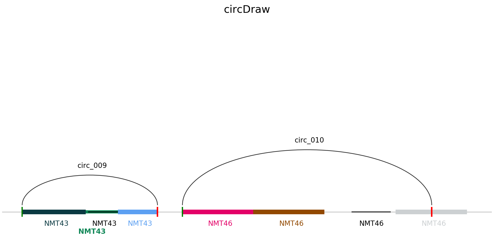
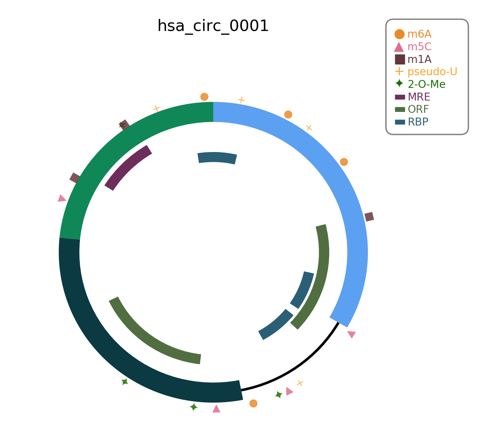

# circDraw
[](https://badge.fury.io/py/circDraw)

A python package for circDraw visualization and circDraw webservice api.


## Installation

```shell
pip3 install circDraw

# install dependencies
pip3 install numpy
pip3 install matplotlib
pip3 install colour
pip3 install requests
```

- Python3
- Matplotlib
- Numpy
- Colour


## Usage

## Draw with circDraw

```python
from circDraw import circDraw

 # initiate a circDraw instance
cd = circDraw()

# set color of circ_on_chr (optional)
cd.set_palette(["#5CA0F2", "#FF881D", '#e30067', '#924900','#ab9c00','#ccd0d2', '#075800', '#5e0094',])

# set color of modifications (optional)
mod_palette = {'m6a': '#E98B2A',
               'm5c': '#E16B8C',
               'm1a': '#64363C',
               'pu': '#ffa12c',
               '2ome': '#1a6f00',
               'mre': '#6D2E5B',
               'rbp': "#2B5F75",
               'orf': '#516E41'}
cd.set_mod_palette(mod_palette)

# draw backsplicing site on chromosome region
cd.circ_on_chr('Your file')

# draw modifications on circRNA
cd.mod_on_circ('Your file')
```





### API

#####circ_on_chr

```python
circDraw.circ_on_chr(file, title='circDraw', dpi=300, save='png', show=True, size=(10, 5))
```

- File:
  
  - Only supported 'csv'
    
  - | Start | End  | Type | Name | Color (Optional) |
    | ----- | ---- | ---- | ---- | ---------------- |
    |       |      |      |      |                  |
  
  - Start < End
  
  - Type: **circ**, **exon**, **intron**, **gene**
  
  - Color: RGB, RGBA, hex, or [supported color names](https://matplotlib.org/examples/color/named_colors.html).
  
- Title: The title of the plot

- Save: file format you wish to save as, **PNG**, **PDF**, **JPEG**, etc.

- Show: Bool, wheather to show the plot after rendering.

- Size: (Length, Width) the size of the plot.

#####mod_on_circ

```python
circDraw.mod_on_circ(self, file, dpi=100, save='png', show=True, size=(7, 7), sep_mod=False)
```

- File:

  - Only supported 'csv'

  - | Start | End  | Type | Name | Color (Optional) |
    | ----- | ---- | ---- | ---- | ---------------- |
    |       |      |      |      |                  |

  - Start < End

  - Type: **circ**, **exon**, **intron**, and modifications type

    - Modifications type: **m6A**, **m1A**, **m5C**, **pU**, **2OMe**, **MRE**, **RBP**, **ORF**

  - Color: RGB, RGBA, hex, or [supported color names](https://matplotlib.org/examples/color/named_colors.html).

- Save: file format you wish to save as, **PNG**, **PDF**, **JPEG**, etc.

- Show: Bool, wheather to show the plot after rendering.

- Size: (Length, Width) the size of the plot.

- sep_mod: Bool, prevent the modifications from overlapping if set **True**.

##### set_palette

```python
circDraw.set_palette(palette)
```

A list of colors, the length of the list must bigger than 5.

##### set_mod_palette

```python
circDraw.set_mod_palette(palette)
```

A dictionary of colors match with the modification. You can change any one of the modification colors.


## Upload to circDraw webservice
### Upload on command line
#### Upload files with parameters
- Sinle upload file
```bash
$ circDraw-upload -f test_circfile.bed -t BED -s human-hg19
```


- Multiple upload files
```bash
$ circDraw-upload -f test_circfile.bed -t BED -s human-hg19 -f test_circfile.bed -t BED -s human-hg19
```


#### Upload file with init file
circDraw-upload also supports upload file from one init file to avoid tedious typing through command line. You can specify the uploaded filename, file type and its origin species in a single csv file. The cvs file should follow the following format with "," seperate each column:

Upload filename | Upload file type | Origin species
--- | --- | ---
 | | 

__Note__: Currently circDraw only supports limited filetype and species, they are specified in the following table:

Uploaded file type | Represent string | Description
--- | --- | ---
_.BED_ | 'BED' | BED (Browser Extensible Data) format provides a flexible way to define the data lines that are displayed in an annotation track. BED lines have three required fields for each line: chrom, chromStart, chromEnd. For more information about BED format we accepted, please visit our example in circDraw [upload](https://www.circdraw.com/tools/) page.
_.CIRI_ | 'CIRI' | Output file from 'Gao, Y., Wang, J. & Zhao, F. CIRI: an efficient and unbiased algorithm for de novo circular RNA identification. Genome Biol 16, 4 (2015) doi:10.1186/s13059-014-0571-3'


Species | Represent string | Description
--- | --- | ---
Human(hg19) | 'human-hg19' | Human Genome Reference Sequencing [(GRCh37/h19)](https://genome.ucsc.edu/cgi-bin/hgTracks?db=hg19&lastVirtModeType=default&lastVirtModeExtraState=&virtModeType=default&virtMode=0&nonVirtPosition=&position=chr1%3A11102837%2D11267747&hgsid=784255443_iXvZctwCCbA7VtPbVPYG30Ix5ueN) from Feb 2009.
Human(hg38) | 'human-hg38' | Human Genome Reference Sequencing [(GRCh38/h38)](https://genome.ucsc.edu/cgi-bin/hgTracks?db=hg38&lastVirtModeType=default&lastVirtModeExtraState=&virtModeType=default&virtMode=0&nonVirtPosition=&position=chr1%3A11102837%2D11267747&hgsid=784255443_iXvZctwCCbA7VtPbVPYG30Ix5ueN) from Dec 2013.
Mouse(mm10) | 'mouse-mm10' | Mouse Genome Reference Sequencing [(GRCm38/mm10)](https://genome.ucsc.edu/cgi-bin/hgTracks?hgsid=784255443_iXvZctwCCbA7VtPbVPYG30Ix5ueN&org=Mouse&db=mm10&position=chr12%3A56%2C694%2C976-56%2C714%2C605&pix=1420) from Dec 2011.
Rat(rn6) | 'rar-rn6' | Rat Genome Reference Sequencing [(RGSC6.0/rn6)](https://genome.ucsc.edu/cgi-bin/hgTracks?db=rn6&lastVirtModeType=default&lastVirtModeExtraState=&virtModeType=default&virtMode=0&nonVirtPosition=&position=chr1%3A80608553%2D80639261&hgsid=784255443_iXvZctwCCbA7VtPbVPYG30Ix5ueN) from Jul 2014.
Yeast(sacCer3) | 'yeast-sacCer3' | Yeast Genome Reference Sequencing [(SacCer_Apr2011/sacCer3)](https://genome.ucsc.edu/cgi-bin/hgTracks?db=sacCer3&lastVirtModeType=default&lastVirtModeExtraState=&virtModeType=default&virtMode=0&nonVirtPosition=&position=chrIV%3A765966%2D775965&hgsid=784255443_iXvZctwCCbA7VtPbVPYG30Ix5ueN) from Apr 2014.
Zebra Fish(danRer11) | 'zebra-fish-danRer11' | Zebra Fish Genome Reference Sequencing [(GRCz11/danRer11)](https://genome.ucsc.edu/cgi-bin/hgTracks?db=danRer11&lastVirtModeType=default&lastVirtModeExtraState=&virtModeType=default&virtMode=0&nonVirtPosition=&position=chr6%3A43426669%2D43433274&hgsid=784255443_iXvZctwCCbA7VtPbVPYG30Ix5ueN) from May 2017.


- Single upload file
```bash
$ circDraw-upload -i test_init_single.txt
```


- Multiple upload files
```bash
$ circDraw-upload -i test_init_multiple.txt
```


### Help
```bash
$ circDraw-upload -h
$ circDraw-upload --help

usage: circDraw-upload [-h] [-f FILE] [-t {BED,CIRI}]
                       [-s {human-hg19,human-hg38,mouse-mm10,rat-rn6,yeast-sacCer3,zebra-fish-danRer11}]
                       [-i INITFILE]

Upload command line interface for circDraw web server.

optional arguments:
  -h, --help            show this help message and exit
  -f FILE, --file FILE  Filename you want to upload.
  -t {BED,CIRI}, --type {BED,CIRI}
                        Filetype of your file, circDraw currently supports
                        ['BED', 'CIRI']. Names of the selected file type
                        should be exactly matched.
  -s {human-hg19,human-hg38,mouse-mm10,rat-rn6,yeast-sacCer3,zebra-fish-danRer11}, --species {human-hg19,human-hg38,mouse-mm10,rat-rn6,yeast-sacCer3,zebra-fish-danRer11}
                        Specify your species, currently circDraw support
                        ['human-hg19', 'human-hg38', 'mouse-mm10', 'rat-rn6',
                        'yeast-sacCer3', 'zebra-fish-danRer11']. Names of the
                        species should be exactly matched.
  -i INITFILE, --initfile INITFILE
                          header filename which specify the information of
                        uploaded filename, uploaded filetype and corresponding
                        species; File should be in csv format where each row
                        represents a file, and three column should be
                        (filename, filetype, species). Note that this mode
                        overwrites any '-f', '-t', '-s' input.

```

## Dependancy
- argparse==1.4.0+  https://pypi.org/project/argparse/
- requests==2.22.0+ https://pypi.org/project/requests/

## More information
This a part of circDraw project. Please visit our [Contact](https://www.circdraw.com/information/about) page if you have any questions.

**Copyright**: Qu Lab, School of Life Science, Sun Yat-sen University, Guangzhou, CHINA.


